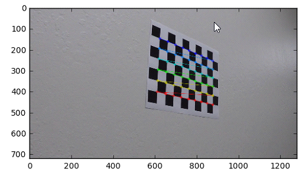
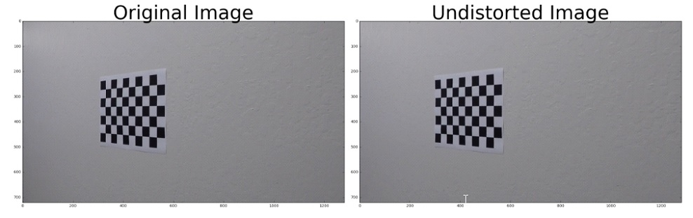
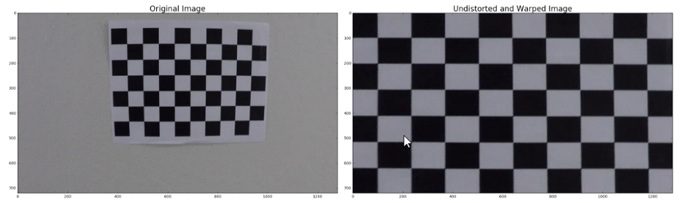
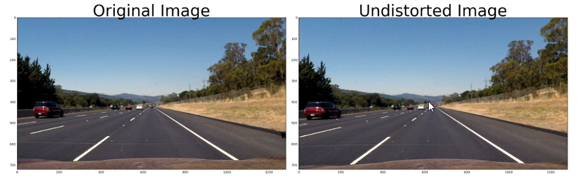
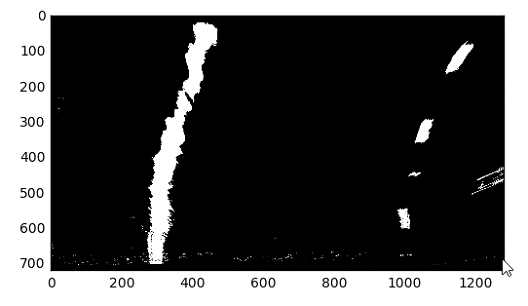
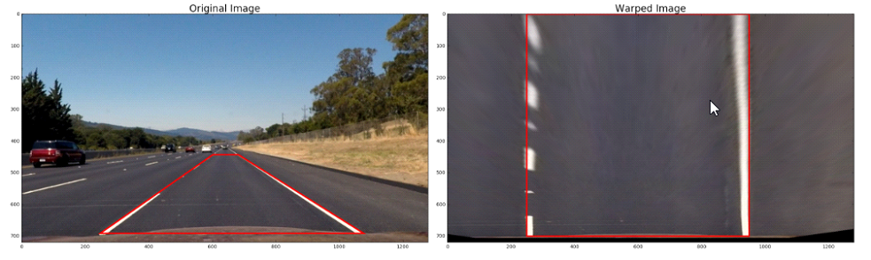
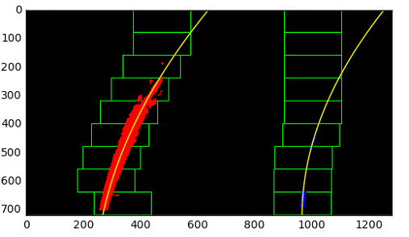
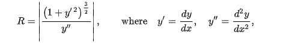
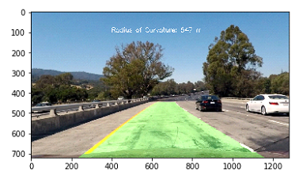

## Advanced Lane Detection

The goal of this project is to detect lane and lane curvature based on the video feed from a vehicle camera.

Here is a bried summary of the steps that needed to be taken
* Camera calibration matrix and distortion coefficients needed to be calculated based on a set of chessboard image
* Apply these coefficients to correct the raw images
* Color transforms , gradients(Sobel) was applied to create a thresholded binary image. 
* Applied a perspective transform to rectify binary image ("birds-eye view").
* Detected lane pixels and fit to find the lane boundary from the binary image
* Determined the curvature of the lane and vehicle position with respect to center
* Warped the detected lane boundaries back onto the original image.
* Overlayed a visual display of the lane boundaries and numerical estimation of lane curvature and vehicle position.

### Repository Contents
#### Files
**main.ipynb:** is a Jupyter Notebook containing the project and detailed explanation of each step. You can setup the anaconda environment by importing MachineLearning.yml from AnacondaEnv folder  
#### Folders
**AnacondaEnv:** contains yml file to setup the anaconda environment. File to import for this project MachineLearning.yml  
**CameraCalibrationImages:** contains all checkerboard images for camera calibration  
**docimages:** document images  
**ResultVideo:** contains the input and output video of the project  
**TestImagesAndVideos:** contains the images worked on for image processing and lane detection    

## Details:
### Camera Calibration
I start by preparing "object points", which will be the (x, y, z) coordinates of the chessboard corners in the world. Here I am assuming the chessboard is fixed on the (x, y) plane at z=0, such that the object points are the same for each calibration image. Thus, objp is just a replicated array of coordinates, and objpoints will be appended with a copy of it every time I successfully detect all chessboard corners in a test image. imgpoints will be appended with the (x, y) pixel position of each of the corners in the image plane with each successful chessboard detection.   
  
I then used the output objpoints and imgpoints to compute the camera calibration and distortion coefficients using the cv2.calibrateCamera() function. I applied this distortion correction to the test image using the cv2.undistort() function and obtained this result:  
  
After undistorting the image I used perspective Transform to to warp the image. 
  

### Distortion Correction 
I used the objpoints and imgpoints matrix obtained from the chessboard calibration to calibrate the camera as well as undistort it.  
   

### Color Transforms and gradient
img_process() function processed the input image to perform gradient(Sobel) and color transform(HLS). By using this technique, we can easily apply a threshold on the color values to distinguish between the lane and the road. This function also undistorts the image as well as performs a perspective transform for a bird eye view of the lane.  
  

### Perspective Transform
For perspective transform, I got four corner points from the lane image as my src and considered a destination rectangle of shape [250,0]  ,  [950,0]  ,  [950,700]  ,  [250,700]. Then I used opencv function of getPerspectiveTransform to get the transform matrix and used warpPerspective function to warp the image  
  

### Lane Identification
Sliding window method was used to locate the lanes. By taking a histogram of the bottom half of the image, we can determine the lanes based on the peak values.  
I used 9 sliding windows for left and right line each to determine the lane path. Bottom windows were placed based on the peak values and the rest were placed based on the midpoint of the previous window.  
Finally, I fitted a second order polynomial through the left and right lanes to predict the lane curvature.  
  

Here's the formula used to calculate radius of curvature:  
  

### Image Processing
All of the above code was combined to process a lane image and detect lane lines. An inverse transform of the warped perspective image was used to plot the lane lines back on the road.  
  

### Video Processing
Video consists of a frame of images. So the above code was applied to each frame of the video to obtain a visual representation of lane detection.
You can run the Jupyter notebook file to watch the video or you could watch it here:  
https://www.youtube.com/watch?v=ObhuzwvHhhY&feature=youtu.be

### Improvements
The algorithm currently stores 12 previous fit line coefficients and takes a running average of them for each frame. This is good for the basic lane detection, but lacks sanity checks on whether the lane detection is good or not. Such issues make it difficult to detect lanes on a very sunny day or night time, where the contrast is not much.
